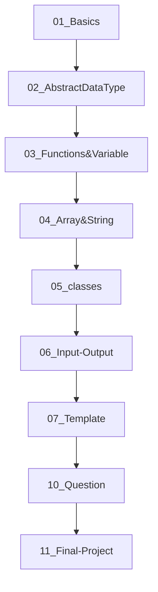

<div align="center">

# 🚀 C++ Learning Playground

### *Master C++ from fundamentals to advanced concepts with hands-on examples and real-world projects*


</div>

---

## 📖 About

Welcome to the **C++ Learning Playground** – your comprehensive journey through C++ programming! Whether you're a complete beginner or looking to sharpen your skills, this repository offers structured learning paths, practical examples, and engaging projects to elevate your C++ mastery.

<div align="center">

*🎯 Learn • 🛠️ Practice • 🚀 Master*

</div>

---

## ✨ Features

<table>
<tr>
<td width="50%">

### 🎯 **Structured Learning**
- Progressive difficulty levels
- Clear learning path recommendations
- Topic-based organization

### 📚 **Comprehensive Coverage**
- Object-Oriented Programming
- Data Structures & Algorithms
- Template Programming
- File I/O & Exception Handling

</td>
<td width="50%">

### 🛠️ **Hands-On Practice**
- Runnable code examples
- Real-world projects
- Practice questions & challenges

### 🔧 **Developer Friendly**
- VS Code optimized
- Well-documented code
- Cross-platform support

</td>
</tr>
</table>

---

## 🚀 Quick Start

### Prerequisites

<div align="center">

| Requirement | Description |
|-------------|-------------|
| 🔧 **C++ Compiler** | GCC, Clang, or MSVC |
| 💻 **IDE** | Visual Studio Code (recommended) |
| 📦 **Git** | For cloning the repository |

</div>

### Installation

```bash
# 1️⃣ Clone the repository
git clone https://github.com/Piyush64-bit/CPP-Programs.git

# 2️⃣ Navigate to the project
cd CPP-Programs

# 3️⃣ Open in VS Code
code .
```

### Running Your First Example

```bash
# 📂 Navigate to basics
cd 01_Basics

# 🔨 Compile and run
g++ -o polymorphism polymorphism.cpp
./polymorphism
```

> 💡 **Tip**: Each `.cpp` file is self-contained and ready to run!

---

## 💡 Usage Guide

### 🎓 Recommended Learning Path



### 📋 Examples

<details>
<summary><b>🔍 Click to see example usage</b></summary>

```bash
# Object-Oriented Programming
cd 01_Basics
g++ -o inheritance inheritance.cpp && ./inheritance

# Data Structures
cd 02_AbstractDataType
g++ -o stack stack.cpp && ./stack

# Templates
cd 07_Template
g++ -std=c++17 -o templates template_example.cpp && ./templates
```

</details>

---

## 📁 Project Structure

```
🏗️ C++ Learning Playground/
├── 📚 01_Basics/                 # OOP Fundamentals
│   ├── 🔄 polymorphism.cpp
│   ├── 🏗️ inheritance.cpp
│   └── 🔒 encapsulation.cpp
├── 📊 02_AbstractDataType/       # Data Structures
│   ├── 📚 stack.cpp
│   └── 📋 queue.cpp
├── ⚙️ 03_Functions&Variable/     # Functions & Memory Management
├── 🔤 04_Array&String/          # Arrays & String Manipulation
├── 🏛️ 05_classes/               # Advanced Class Concepts
├── 📁 06_Input-Output/          # File I/O & Exception Handling
├── 🎯 07_Template/              # Generic Programming
├── ❓ 10_Question/              # Practice Problems & Solutions
├── 🎓 11_Final-Project/         # Student Management System
└── 📖 README.md
```

---

## 🛠️ Built With

<div align="center">

[](https://isocpp.org/)
[](https://code.visualstudio.com/)
[](https://git-scm.com/)

</div>

---

## 🗺️ Roadmap

- [ ] 🚀 **C++20 Features** - Concepts, Modules, Coroutines
- [ ] 🖼️ **GUI Programming** - Qt/GTK examples
- [ ] 🧪 **Unit Testing** - Google Test integration
- [ ] 🎥 **Video Tutorials** - Step-by-step explanations
- [ ] ⚡ **Performance** - Optimization techniques
- [ ] 🌐 **Web Integration** - WebAssembly examples

---

## 🤝 Contributing

<div align="center">

**🌟 Contributions are what make the open-source community amazing! 🌟**

</div>

### How to Contribute

1. 🍴 **Fork** the repository
2. 🌿 **Create** your feature branch (`git checkout -b feature/AmazingFeature`)
3. 💾 **Commit** your changes (`git commit -m 'Add some AmazingFeature'`)
4. 📤 **Push** to the branch (`git push origin feature/AmazingFeature`)
5. 🔄 **Open** a Pull Request

### 🎯 Ways to Help

| Type | Description |
|------|-------------|
| 🐛 **Bug Reports** | Found a bug? Let us know! |
| 💡 **Feature Ideas** | Have a cool idea? Share it! |
| 📚 **Documentation** | Help improve our docs |
| 🧪 **Examples** | Add more code examples |

---

## 📄 License

This project is licensed under the **MIT License** - see the [LICENSE](LICENSE) file for details.

<div align="center">

*Feel free to use, modify, and distribute! 🎉*

</div>

---

## 🌐 Connect & Support

<div align="center">

[](https://linkedin.com/in/yourprofile)
[](mailto:your.email@example.com)
[](https://yourportfolio.com)
[](https://github.com/Piyush64-bit)

**⭐ Star this repo if you found it helpful!**

</div>

---

<div align="center">

### 🎯 Ready to Master C++?

> *"The best way to learn programming is by programming!"*

**Made with ❤️ by [Piyush64-bit](https://github.com/Piyush64-bit)**

*Open source forever 🚀*

</div>